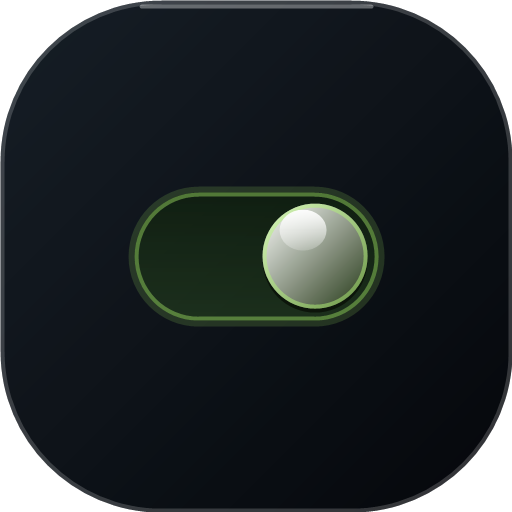
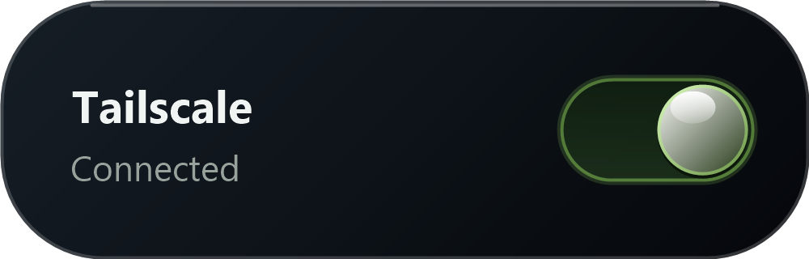
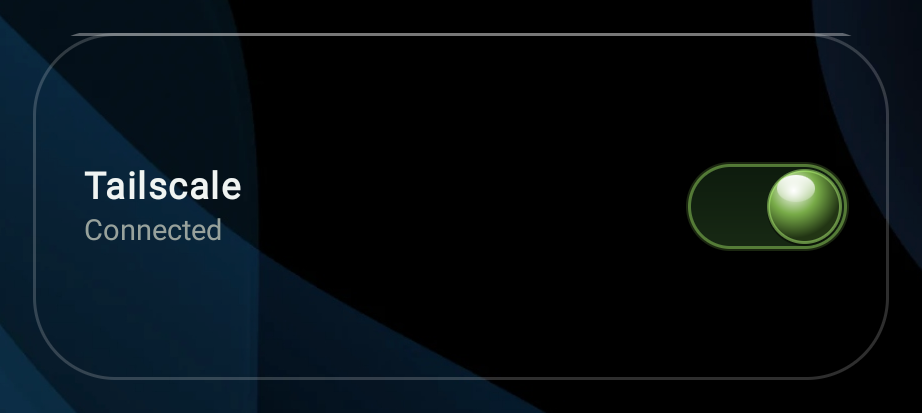
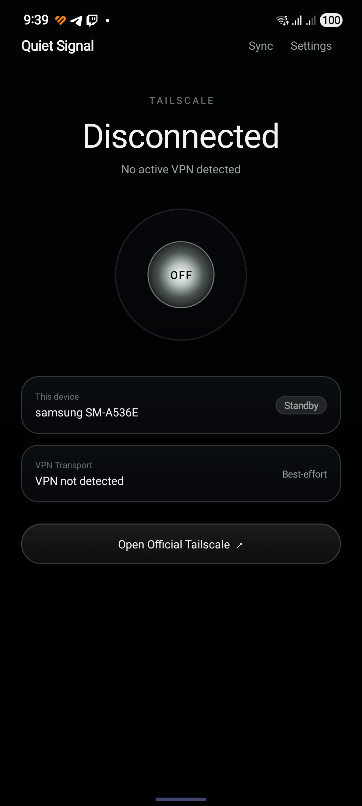
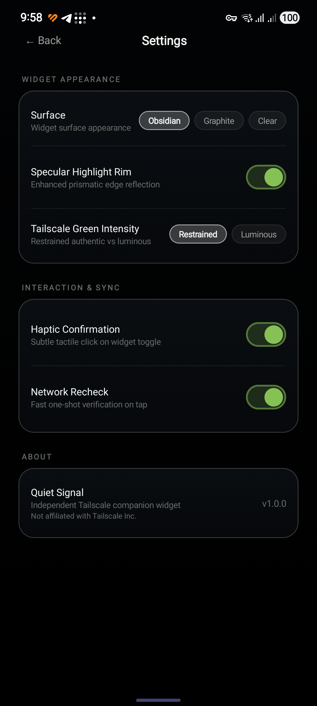
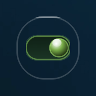

# Quiet Signal

A lightweight, open-source **Android home-screen companion widget for Tailscale** — a liquid-glass
toggle for your VPN, in a 1×1 squircle or a responsive 2×1 bar.

> **Quiet Signal is an independent third-party project.**
> It is **not** an official Tailscale application, is **not** affiliated with, endorsed by, or
> sponsored by Tailscale Inc., and it does **not** contain, bundle, or reimplement Tailscale's VPN.
> The official **Tailscale** Android app remains the VPN implementation — Quiet Signal is only a
> companion control surface for it.

---

## Overview

Quiet Signal puts the two things you actually want from a VPN on your home screen:

* **a 1×1 widget** — a miniature liquid-glass switch in a Deep Obsidian squircle, and
* **a responsive 2×1 widget** — brand + state on the left, the full liquid-glass switch on the right.

Tapping a widget asks the official Tailscale app to connect or disconnect. The widgets then reflect
the **Android VPN state that Quiet Signal can actually observe**, honestly labelled as best-effort
evidence rather than an authoritative Tailscale session readout.

There is no backend, no account, no analytics and no telemetry. Quiet Signal has **no internet
permission at all**.

---

## Features

* **1×1 liquid-glass widget** — miniature horizontal switch in a tuned squircle housing, no text, no clipping.
* **Responsive 2×1 widget** — one provider, four breakpoints (minimum, normal, tall, wide + tall);
  extra space becomes breathing room, never a dashboard.
* **Connect / disconnect control** — taps are forwarded to the official Tailscale app.
* **Three widget surfaces**
  * **Obsidian** — deep gloss black glass
  * **Graphite** — smoked grey glass
  * **Clear** — genuinely transparent housing: your wallpaper shows through, with only a subtle rim plus the switch
* **Appearance settings that are all functional** — surface, specular highlight rim, Tailscale green intensity.
* **Interaction settings** — haptic confirmation on widget tap, and network recheck (the optional
  one-shot verification sweep).
* **Companion app** — live state, device identity read from the real device, and an honest
  `best-effort` VPN transport reading.
* **Adaptive icon** (foreground / background / **monochrome** for themed icons) and a Deep Obsidian splash screen.
* **Widget picker previews** that show the real widget design (Android 12+ `previewLayout`, plus a
  PNG `previewImage` fallback for older launchers).
* **No backend. No account. No analytics. No telemetry. No credentials.**

---

## Screenshots

| 1×1 widget (Obsidian) | 2×1 widget (Obsidian) | 2×1 widget (Clear) |
| --- | --- | --- |
|  |  |  |

| Companion app | Settings | 1×1 widget (Clear) |
| --- | --- | --- |
|  |  |  |

`widget-1x1.png` and `widget-2x1.png` are geometry-accurate renders of the **Obsidian** surface
produced by `tools/gen_widget_previews.ps1`; the other four are captures from a real device.
The **Clear** captures show why that surface is called clear — the wallpaper stays visible *through*
the housing, and only the rim, the specular arc and the switch are drawn. The 2×1 Clear capture is
taken at the **Normal** breakpoint (brand + state line) on a 420 dpi device.

### 2×1 widget breakpoints

The 2×1 widget is a single provider with four layouts. `TailscaleWidgetProvider` measures the current
widget size in dp and picks the layout automatically; extra space always becomes breathing room — the
switch is fixed-size and is never stretched.

| Breakpoint | Selected when | Layout | What renders |
| --- | --- | --- | --- |
| **Minimum** | height < 90 dp | `widget_tailscale_minimal` | brand only, no state line, 52 × 30 dp switch |
| **Normal** | height ≥ 90 dp | `widget_tailscale` | brand + state line, 62 × 34 dp switch |
| **Tall** | height ≥ 150 dp | `widget_tailscale_tall` | Normal, plus 22 dp top/bottom padding |
| **Wide + tall** | width ≥ 300 dp **and** height ≥ 150 dp | `widget_tailscale_wide_tall` | Tall, plus 28 / 24 dp leading/trailing padding |

The Android 12+ `SizeF` mapping and the pre-12 `layoutFor()` fallback share the same thresholds, so
the breakpoint behaviour is identical on older launchers.

> **The state line needs a second row.** A 2×1 widget placed at its default size
> (`targetCellHeight="1"`, i.e. one launcher row) is shorter than 90 dp — measured **52 dp** on a
> 420 dpi device, where a 2×1 row is 330 × 52 dp. That lands on the **Minimum** breakpoint, which
> shows the brand only. Drag the widget one row taller (≥ 90 dp) to reveal the state line.
> The 1×1 widget is unaffected: it is text-free by design at every size.

---

## Installation

Quiet Signal is distributed **manually through GitHub Releases** (it is not published on Google Play).

1. Install the official **Tailscale** app from Google Play and sign in.
2. Download `QuietSignal-v1.0.0.apk` from the [Releases](../../releases) page.
3. Allow installation from your browser/file manager when Android asks (Settings → Apps →
   Special access → Install unknown apps).
4. Install, open **Quiet Signal** once, then add the widgets from your launcher's widget picker.

> Keeping the same signing key for later versions is what allows in-place upgrades. If you build
> your own APK, use your own keystore (see [Development](#development)).

---

## Requirements

* **Android 8.0 (API 26) or newer** — a home screen that supports app widgets (most launchers do).
* The **official Tailscale Android app** (`com.tailscale.ipn`) installed and signed in for
  connect/disconnect control to do anything.


---

## Tailscale Integration

Quiet Signal never creates a VPN interface and never requests the `BIND_VPN_SERVICE` permission.
It is a companion, and it uses the two integration points that actually exist for a third-party app:

**1. Control — explicit broadcasts to the official app**

```
com.tailscale.ipn / com.tailscale.ipn.IPNReceiver
  action: com.tailscale.ipn.CONNECT_VPN
  action: com.tailscale.ipn.DISCONNECT_VPN
```

`TailscaleIntegration` sends these as *explicit* component broadcasts, so the request reaches only
the official Tailscale receiver. Each request gets a correlation id, and the UI enters a real
`Connecting…` / `Disconnecting…` transition while it waits for evidence.

**2. Observation — public Android VPN evidence (best-effort)**

`VpnStateMonitor` registers a `ConnectivityManager` network callback for `TRANSPORT_VPN`, and
cross-checks `activeNetwork` capabilities as a fallback. That tells Quiet Signal whether *an*
Android VPN interface is present — never *who* owns it.

`StateRepository` is the single source of truth that turns that evidence plus the in-flight
transition into a UI/widget state, with a 12-second safeguard timeout and (optionally) short
one-shot reconciliation bursts.

---

## Limitations

Please read these before filing an issue — they are by design, not bugs:

* **VPN state is best-effort evidence, not Tailscale truth.** Android exposes *whether* a VPN
  transport exists, not which app owns it or whether it is Tailscale. Quiet Signal therefore cannot
  claim authoritative Tailscale ownership state, and the UI deliberately says
  *“Android VPN active”*, *“VPN detected”*, *“VPN not detected”* or *“Unknown”* instead of claiming
  certainty. “Active” means an Android VPN interface was observed.
* **Another VPN app can produce the same evidence.** If a different VPN is connected, the widgets
  will legitimately report an active VPN.
* **Connect/disconnect is a request, not a guarantee.** Quiet Signal asks the official app to act.
  If Tailscale declines (not signed in, needs re-auth, blocked), the state falls back to
  `Needs attention` / `Unknown` after the safeguard timeout rather than pretending.
* **Tailscale's internal broadcast interface is unofficial.** Those actions are Tailscale's own
  receiver contract; a future Tailscale release could rename them, which would require a Quiet
  Signal update. The official app remains the source of truth and can always be opened directly.
* **Widgets update on transitions and on the OS update cadence.** Android controls how often widgets
  may refresh; changes made inside the official app are picked up on the next refresh, on app open,
  or on tap.
* **No protocol attribution.** Quiet Signal never claims WireGuard, DERP, or exit-node details.

---

## Privacy

Quiet Signal has **no backend and no account**, and it declares **no internet permission**.

* No analytics, no telemetry, no crash reporting, no advertising.
* No credentials, tokens, keys or VPN configuration are read, stored or transmitted.
* The only thing persisted locally is your own appearance/interaction preference (surface choice,
  specular rim, green intensity, haptics, network recheck) in a private `SharedPreferences` file.
* Device identity shown in the app (“This device”) is read from `android.os.Build` at runtime.

---

## Architecture

| Component | Responsibility |
| --- | --- |
| `StateRepository` | Single source of truth for state: combines observed VPN evidence with the in-flight transition, owns the safeguard timeout + optional one-shot reconciliation, publishes `TailscaleSnapshot`, and asks the widgets to refresh. |
| `VpnStateMonitor` (`VpnStateReader.kt`) | Registers a `TRANSPORT_VPN` `ConnectivityManager` network callback, maintains the observed VPN-network set, and falls back to `activeNetwork` capabilities. Emits `VPN_PRESENT` / `VPN_ABSENT` / `UNAVAILABLE`. |
| `TailscaleIntegration` | The only place that talks to the official Tailscale app: explicit `CONNECT_VPN` / `DISCONNECT_VPN` broadcasts, install check, and app launch. |
| `WidgetUpdater` | Fans a state change out to every live 2×1 and 1×1 widget instance. |
| `TailscaleWidgetProvider` | Responsive 2×1 widget: selects the layout for the current breakpoint, resolves the surface/rim/green drawables from settings, and wires the tap target. |
| `TailscaleCompactWidgetProvider` | Fixed 1×1 squircle widget: same settings-driven drawable resolution with the miniature switch. |
| `SettingsRepository` | Persists and exposes `UserSettings` (surface, specular rim, green intensity, haptics, network recheck) via `StateFlow` + `SharedPreferences`. |
| `MainActivity` | Compose companion UI: live state, device card, VPN transport card, settings screen. |

Drawable naming: `widget_glass_<surface>[_flat].xml` (2×1) and
`widget_compact_glass_<surface>[_flat].xml` (1×1); `widget_switch_<state>[_luminous].xml` and
`widget_switch_mini_<state>[_luminous].xml`, where `_flat` = specular rim disabled,
`_luminous` = luminous green intensity, and `clear` = fully transparent surface.

---

## Development

```bash
# Debug build
./gradlew.bat assembleDebug

# Release build (R8 minified, resource-shrunk)
./gradlew.bat assembleRelease

# Verification
./gradlew.bat compileDebugKotlin compileReleaseKotlin test lint
```

* Open the project root in Android Studio (Gradle 8.11.1, AGP 8.9.1, Kotlin 1.9.21, JDK 17).
* `minSdk 26`, `targetSdk 35`, `compileSdk 35`.

**Release signing.** Signing credentials are deliberately **not** in the repository. Create a
`keystore.properties` in the project root (gitignored):

```properties
storeFile=/absolute/path/to/your-release.jks
storePassword=…
keyAlias=…
keyPassword=…
```

Without it the release build still compiles, just unsigned. Keep your keystore private and back it
up: Android only allows in-place upgrades of an app signed by the same key.

**Helper scripts** (`tools/`):

| Script | Purpose |
| --- | --- |
| `gen_widget_previews.ps1` | Regenerates the widget-picker preview PNGs. |
| `gen_widget_variants.ps1` | Regenerates the `_flat` / `_luminous` drawable variants from their base drawables. |
| `localize_widget_strings.ps1` | One-shot migration that moved the widget layouts' hardcoded strings into `@string` resources (lint `HardcodedText`). Already applied. |
| `optimize_release_assets.ps1` | Resamples shipped icon/splash artwork to display densities (APK size). |
| `release_build.ps1` | Runs the release verification task list and logs the result. |

---

## Release

Releases are git-tagged (`v1.0.0`) and published as GitHub Releases with the signed APK attached.
The APK is intentionally **not** committed to the source tree.

```bash
git tag -a v1.0.0 -m "Quiet Signal v1.0.0"
git push origin v1.0.0
gh release create v1.0.0 QuietSignal-v1.0.0.apk --title "Quiet Signal v1.0.0"
```

---

## License

[MIT](LICENSE) © Quiet Signal contributors.

Tailscale is a trademark of Tailscale Inc. This project is an independent third-party companion and
is not affiliated with or endorsed by Tailscale Inc.
